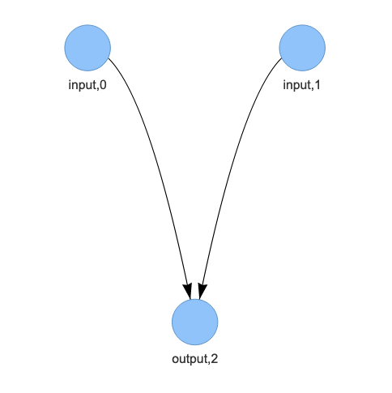
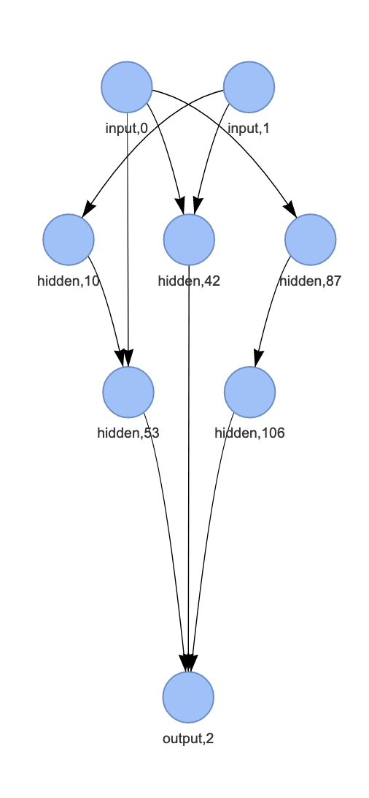

# Nano Neat

Nano Neat is a project focused on implementing NeuroEvolution of Augmenting Topologies (NEAT) for various environments using the Gymnasium library. The project includes experiments on different environments such as Bipedal Walker, CartPole, and Acrobot.

 

<p align="center">
  
  
</p>

| Starting Topology | Evolved XOR-Solving Topology |
|------------------|----------------------------|
|  |  |

## Project Structure

- /experiments/old_approaches: Contains older versions of the Bipedal Walker experiments.
- /experiments/old_approaches/Bipedal_v2_wrk.py: Bipedal Walker experiment version 2.
- /experiments/old_approaches/Bipedal_v1.py: Bipedal Walker experiment version 1.
- /experiments/old_approaches/Bipedal_mate_with_other_experiment.py: Bipedal Walker experiment with mating from another experiment.
- /cart.py: CartPole experiment.
- /cart_results.py: Script to analyze results of CartPole experiments.
- /acrobot.py: Acrobot experiment.
- /acrobot_results.py: Script to analyze results of Acrobot experiments.
- /example.html: Example HTML file.
- /dbg.html: Debug HTML file.

## Model Structure

The model is composed of several key classes:

- Config: Holds configuration parameters for the NEAT algorithm.
- Node: Represents a node in the neural network.
- Connection: Represents a connection between nodes in the neural network.
- Genome: Represents an individual in the population, including its neural network structure.
- Population: Manages the population of genomes and handles the evolution process.
- Specie: Represents a species in the population, used for speciation.

## How to Run

1. Ensure you have the required dependencies installed. You can install them using pip:
   ```
   pip install torch networkx gymnasium pyvis dill
   ```

2. Run the desired experiment script. For example, to run the CartPole experiment:
   ```
   python cart.py
   ```

3. To analyze the results of an experiment, run the corresponding results script. For example, to analyze CartPole results:
   ```
   python cart_results.py
   ```

## Configuration

Each experiment script contains a configuration section where you can adjust parameters such as population size, mutation rates, and fitness thresholds.

## Results

The results of each experiment are saved in the /tmp directory under a subdirectory named after the experiment. Each subdirectory contains the saved models and statistics of the experiment.

## Contact

For any questions or issues, please contact the project maintainer.